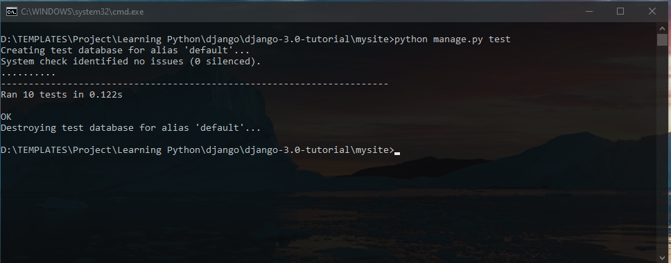

# Django 3.0 tutorial #

This is complete source code of tutorial that I've learnt from django official website.
It consists of 7 parts in **First Step** section.
1. [Part 1: Requests and responses](https://docs.djangoproject.com/en/3.0/intro/tutorial01/)
2. [Part 2: Models and the admin site](https://docs.djangoproject.com/en/3.0/intro/tutorial02/)
3. [Part 3: Views and templates](https://docs.djangoproject.com/en/3.0/intro/tutorial03/)
4. [Part 4: Forms and generic views](https://docs.djangoproject.com/en/3.0/intro/tutorial04/)
5. [Part 5: Testing](https://docs.djangoproject.com/en/3.0/intro/tutorial05/)
6. [Part 6: Static files](https://docs.djangoproject.com/en/3.0/intro/tutorial06/)
7. [Part 7: Customizing the admin site](https://docs.djangoproject.com/en/3.0/intro/tutorial07/)

## Requirements ##
[Python 3](https://www.python.org/)

[Django](https://www.djangoproject.com/) (I've used Django 3.0.7) `pip install django`

[Git](https://git-scm.com/downloads/)

## Installation ##
- `git clone https://github.com/chitkokooo/django-3.0-tutorial.git`
- `cd django-3.0-tutorial\mysite` on Windows (or) `cd django-3.0-tutorial/mysite` on GNU/Linux
- `python manage.py migrate` or `python3 manage.py migrate`
- `python manage.py createsuperuser` or `python3 manage.py createsuperuser`
- `python manage.py runserver` or `python3 manage.py runserver`
- open browser and go to link [http://127.0.0.1:8000/](http://127.0.0.1:8000/)

port number 8000 can be changed as you want, for example [http://127.0.0.1:8888](http://127.0.0.1:8888/) by `python manage.py runserver 8888`

## Screenshots ##

Home Page `http://127.0.0.1:8000/`

Polls Page `http://127.0.0.1:8000/polls/`

Admin Login `http://127.0.0.1:8000/admin/`

`python manage.py runserver` Result

`python manage.py test` Result

## whoami ##
[Facebook](https://www.facebook.com/artisan443)

[Linkedin](https://www.linkedin.com/in/chitkokooo-cu)

Email: chitkokooo.cu at gmail dot com

